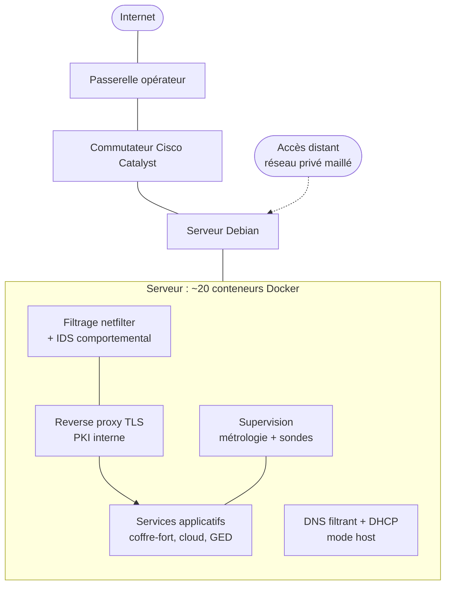

# Homelab auto-hébergé : infrastructure réseau et sécurité

Serveur domestique sous Debian, entièrement conteneurisé, assurant les services
réellement en production d'un réseau résidentiel : DNS, DHCP, reverse proxy avec
PKI interne, stockage, sauvegardes, supervision et filtrage réseau.

La contrainte structurante du projet n'est pas technique mais opérationnelle : le
serveur porte le DNS et le DHCP d'un réseau utilisé par d'autres personnes. Toute
erreur est visible immédiatement, tout changement risqué demande un plan de retour
arrière écrit à l'avance, et les sauvegardes comme la supervision cessent d'être
optionnelles.

## Architecture

Aucun port n'est ouvert sur Internet : l'accès depuis l'extérieur passe
exclusivement par un réseau privé maillé.

## Périmètre technique

| Domaine | Mise en œuvre |
|---|---|
| Système | Debian stable headless, administration SSH exclusive |
| Conteneurisation | Docker Compose, ~20 conteneurs, réseaux cloisonnés |
| Services réseau | DNS récursif filtrant (DoH amont, bascule de résolveur), DHCP avec réservations |
| Exposition | Reverse proxy TLS, autorité de certification interne, certificat `*.home.arpa` |
| Accès distant | Réseau privé maillé WireGuard, aucun port ouvert sur Internet |
| Segmentation | VLAN 802.1Q sur Cisco Catalyst, router-on-a-stick, filtrage inter-VLAN à état |
| Filtrage | netfilter, chaîne dédiée, persistance par unité systemd |
| Détection | IDS comportemental sur journaux SSH et reverse proxy, avec application effective des décisions |
| Supervision | Sondes de disponibilité et métrologie en séries temporelles, 8 panneaux, 5 règles d'alerte |
| Sauvegarde | Dumps PostgreSQL et `rsync --link-dest`, rotation 7 jours, restauration testée |

## Contenu du dépôt

| Dossier | Contenu |
|---|---|
| [`docs/`](docs/) | Documentation technique complète : architecture, choix d'implémentation, incidents et limites |
| [`compose/`](compose/) | Définitions de services expurgées, avec les choix de conception commentés |
| [`network/`](network/) | Configuration du commutateur, sous-interfaces 802.1Q, routage et filtrage inter-VLAN |
| [`firewall/`](firewall/) | Règles du pare-feu applicatif et chaîne `DOCKER-USER`, avec l'unité systemd de persistance |
| [`monitoring/`](monitoring/) | Tableau de bord, règles d'alerte, requêtes commentées et ligne de base |
| [`scripts/`](scripts/) | Script de sauvegarde et procédure de test de restauration |

Ce n'est pas un tutoriel de déploiement. C'est un retour d'expérience : la
documentation consacre délibérément plus de place aux pièges rencontrés qu'aux
commandes qui ont fonctionné.

## Quelques enseignements documentés

Un échantillon des points développés, choisis parce qu'ils sont contre-intuitifs.

**Docker contourne le pare-feu applicatif.** Une règle DNAT écrite en
`PREROUTING` est traversée avant `INPUT`. Pare-feu actif, politique par défaut en
refus, et pourtant les services conteneurisés répondent depuis tout le réseau. Le
malentendu est dangereux parce qu'il produit une confiance injustifiée.
→ [`firewall/`](firewall/)

**Un IDS qui alerte ne protège pas.** L'agent analyse et décide ; c'est un
composant distinct qui applique les décisions dans le pare-feu. Beaucoup
d'installations s'arrêtent à l'agent et en concluent à tort qu'elles sont
couvertes. Validé ici par auto-bannissement volontaire, avec coupure d'accès
effective.

**IPv6 comme angle mort du filtrage DNS.** Des clients contournaient le résolveur
local en obtenant un DNS par IPv6, distribué indépendamment par la passerelle.

**Une sauvegarde jamais restaurée est une hypothèse.** Restauration vérifiée en
trois niveaux : intégrité de l'export, restauration réelle sur base jetable,
contrôle de structure des fichiers. → [`scripts/`](scripts/)

**La valeur d'une métrique vient de l'écart à la ligne de base.** Une attente
disque à 18 % ne signifie rien sans savoir qu'elle est à 0,1 % au repos.
→ [`monitoring/`](monitoring/)

**Les VLAN ne s'effacent pas avec la configuration.** Sur un commutateur
d'occasion, ils sont stockés dans un fichier distinct de la mémoire flash. Sans
suppression explicite, l'intégralité de la configuration du propriétaire
précédent réapparaît après redémarrage. → [`network/`](network/)

## Limites assumées

Documentées en détail dans la section 13 de la documentation, parce qu'une
architecture dont on ne voit aucune faiblesse est une architecture mal comprise :
point unique de défaillance sur le DNS et le DHCP, sauvegardes non délocalisées
(règle 3-2-1 satisfaite à moitié), stockage de données en USB, et plan de
management du commutateur limité à des algorithmes cryptographiques obsolètes.

## Note sur la publication

Ce dépôt est la version publique d'un journal de bord tenu tout au long du projet.
Les adresses, identifiants, noms d'hôtes et noms de services ont été remplacés par
des valeurs génériques ou désignés par leur rôle. Les fichiers de configuration
sont expurgés : mots de passe et jetons sont remplacés par des références à un
fichier d'environnement non versionné.

La configuration héritée trouvée sur le commutateur d'occasion (domaine VTP et
VLAN de production d'un site tiers) est mentionnée uniquement pour décrire la
procédure d'effacement. Aucune de ces données n'est reproduite ici.

## Contexte

Projet personnel mené en parallèle d'une formation Bac+3 en réseaux et
télécommunications, spécialité cybersécurité. Orientation administration et
sécurisation d'infrastructures.

## Licence

Documentation publiée sous CC BY-SA 4.0. Copyright (c) 2026 Thomas Biondi.
